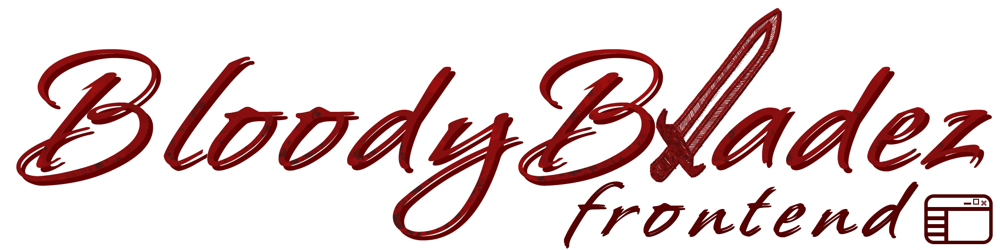

 

## Usage
You can use the automatic `start.sh` or `start.bat` script in the root, or:
1. Install dependencies via `yarn install` (recommended to use [yarn](https://classic.yarnpkg.com/lang/en/docs/install/))
2. Build the project using `yarn build` (or `npm build`)
3. Run it using `yarn run preview` (or `npm run preview`)
4. After all, you can access the site via https://localhost:9051